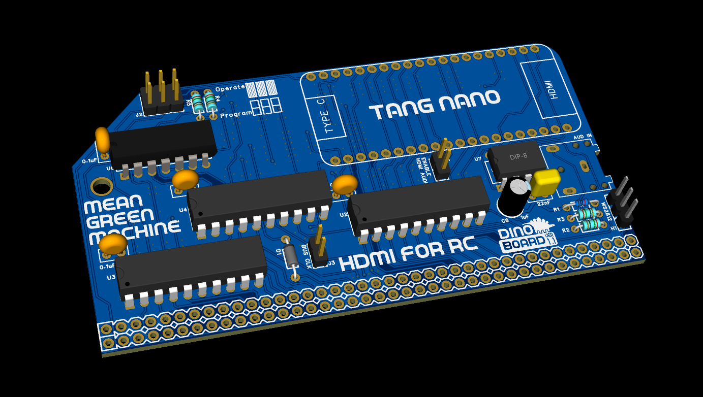

# V9958 - Super

This repo contains the Verilog code to emulate Yamaha's V9958 Video Display Processor.  Its was forked from the project [tn_vdp](https://github.com/lfantoniosi/tn_vdp) (derived from V3).

## Objective

1. To provide the RC2014/RCBus to have HDMI output of an emulated Yamaha V9958 Graphic Video Display Processor
2. Provide enhanced graphics modes with more colours and resolution that the original V9958 supported.

## Key Features

* Compatible with RC2014 (enhanced bus required)
* HDMI output
* Onboard ADC for HDMI audio delivery
* Extended Video modes
* WS2812 RGB LEDs



## Schematic

The current version of the schematic can be found here

* [Schematic](./docs/schematic.pdf)


### Difference with [tn_vdp](https://github.com/lfantoniosi/tn_vdp)

* See [derived-notes.md](./docs/derived-notes.md)

### New Graphics Modes

New 'Super' Display modes -- New hardware registers available for applications to enable higher (super) resolution and colour modes.

The new Resolutions are:

* `SUPER_MID`:   resolution of 50Hz:360x288 (103680 Bytes), 60Hz:360x240 (86400 bytes), 256 colours
* `SUPER_RES`:   resolution of 50Hz:720x576 (414720 Bytes), 60Hz:720x480 (345600 bytes), 256 colours

See [docs/vdp_super_res.md](./docs/vdp_super_res.md) for more details.

## Building FPGA image

Download and install the Gowin IDE.  Currently tested with V1.9.11.01.  See [https://wiki.sipeed.com/hardware/en/tang/common-doc/get_started/install-the-ide.html](https://wiki.sipeed.com/hardware/en/tang/common-doc/get_started/install-the-ide.html)

> Please note I have not been able to get the linux version of the IDE to work.  I use wine on linux to run the windows version.


### Using the Command Line (windows)

> Requires the gowin IDE to be installed at `C:\Gowin64`
> Make sure you have Gowin IDE install to `C:\Gowin64`.  This should include the cli tool at: `C:\Gowin64\Gowin_V1.9.11.01_Education_x64\IDE\bin\gw_sh.exe`

There is a TCL script that contains the required configuration to build the file stream (fs) for the Tang Nano.

Current scripts assume a specific install path for Gowin and only supports running under windows

Within *Windows Subsystem for Linux* (WSL), you can use the `buildwsl.sh` script to shell to windows to build:

```
buildwsl.sh
```

Or In windows, run the BAT file:

```
build.bat
```

> The project may also be built using Gowin GUI IDE, by opening the file `tn_vdp.gprj`.  But please note that the GUI project may not be kept in sync with the tcl file and may be missing files or attempts to included files since deleted.


## Linux: Using command line (wine)

I have not been able to get the tool chain to work natively in linux.  I used wine to invoke the windows binaries.

You will need to download and install the education version (so no need to worry about licence activation process) within your wine environment.

Then run (adjusting path to `gw_shl.exe` as per your version)

```
wine "c:\Gowin64\Gowin_V1.9.11.01_Education_x64\IDE\bin\gw_sh.exe" tn_vdp.tcl
```

or use my helper script (to reduce the verbosity of the output logging):

```
build.sh
```


## To flash/program device, use the opensource programmer

use: openFPGALoader -> https://github.com/trabucayre/openFPGALoader

```
openFPGALoader -b tangnano20k -f ./impl/pnr/project.fs
```

> You can flash the Tang Nano in-circuit, but please remove the 3 Jumpers for J2 and do **not** power to your RC2014/RCBus system.
