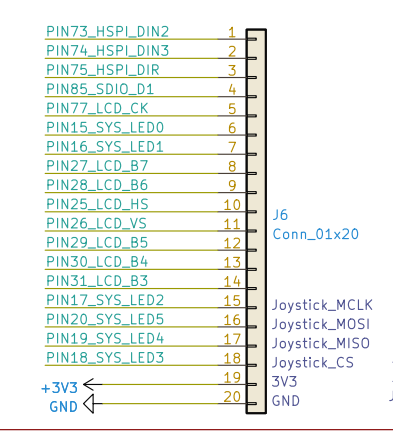
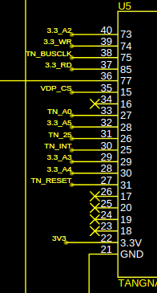
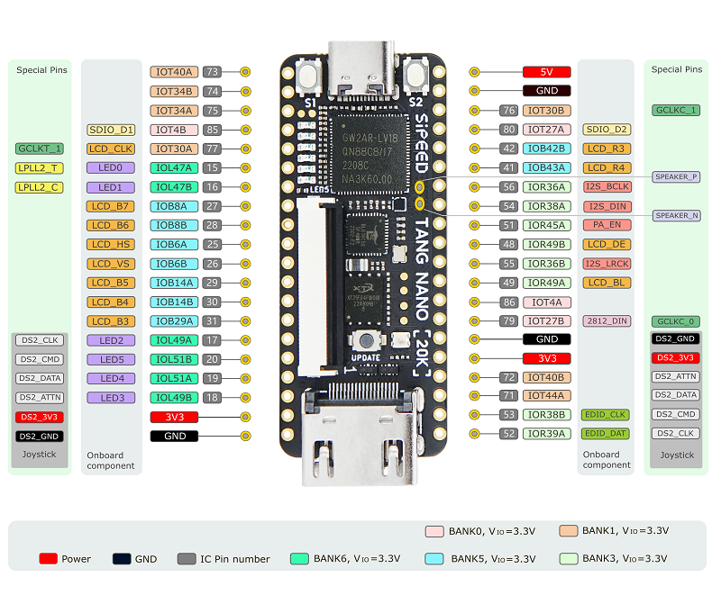
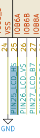

 
 
 

***THE SCHEMATIC ISSUE HAS BEEN CORRECTED AS PER V1.1a of the SCHEMATIC***

 
 
 

---
## Summary of issue with apparent PIN 25/26 incorrectly assigned

The footprint used in the schematic for the Tang Nano 20K, has incorrectly swapped labeled
pins `25` and `26`

Hence why the trace for `TN25` on the schematic, appears to be incorrectly connected to `26`.  The trace is correct and the label on the footprint it wrong.

This is confirmed with reviewing the docs from Gowin (and the verification of implemented board).

According to the Gowin schematic for the module (Tang_Nano_20K_3921_Schematics), the module's left pin outs (as view from top with HDMI port at bottom) are:

* Pin 10 is PIN25_LCD_HS
* Pin 11 is PIN26_LCD_VS

* Pin 10 physically maps to PIN 31 in the V9958-Super's schematic
* Pin 11 physically maps to PIN 30 in the V9958-Super's schematic

* PIN 30 is incorrectly named "25" (should be 26)
* PIN 31 is incorreclty named "26" (should be 25)

So the pin assignments within the `v9958.cst` are correct:

The 'exclude_audio" link linked to PIN 25
The 'int_n' linked to PIN 26

---

Traces within the module all confirm that the V9958's schematic is not correct as per the TN20K's specification.

Module's pin out description are:

* PIN 25 is named IOB6A
* PIN 26 is named IOB6B

Traces to the FPGA are:

* PIN25_LCD_HS goes to pin 25 of the FPGA and is named IOB6A
* PIN26_LCD_VS goes to pin 26 of the FPGA and is named IOB6B

